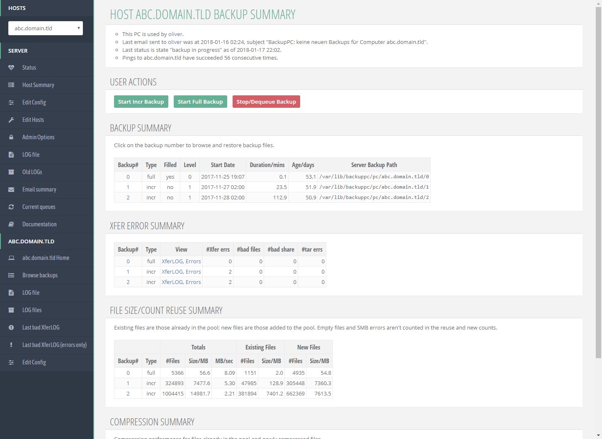

# BackupPC-v3-BetterCSS
A more modern CSS for BackupPC v3, heavily inspired by INSPINIA Bootstrap Theme. Works best with BackupPC set to English or German. If you use another language be sure to edit the `input[value=]` selectors to your language.

# How to use
Place the CSS file in `/usr/share/backuppc/image/` and change the CSS path either in the config file itself (`/etc/backuppc/config.pl` -> `$Conf{CgiCSSFile}`) or in the BackupPC GUI (Edit Config -> CGI -> CgiCSSFile)

If you don't see the FontAwesome menu icons you are probably using BackupPC in a different subfolder than the default "/backuppc/". Replace all `/backuppc/index.cgi` with `/yoursubfolder/index.cgi` or just `/index.cgi` if you're not using a subfolder.

If the host menu is out of place you can change the `margin-top` values in:
* br + div[class="NavMenu"] {
* div[class="NavMenu"] + div[class="NavMenu"] {

