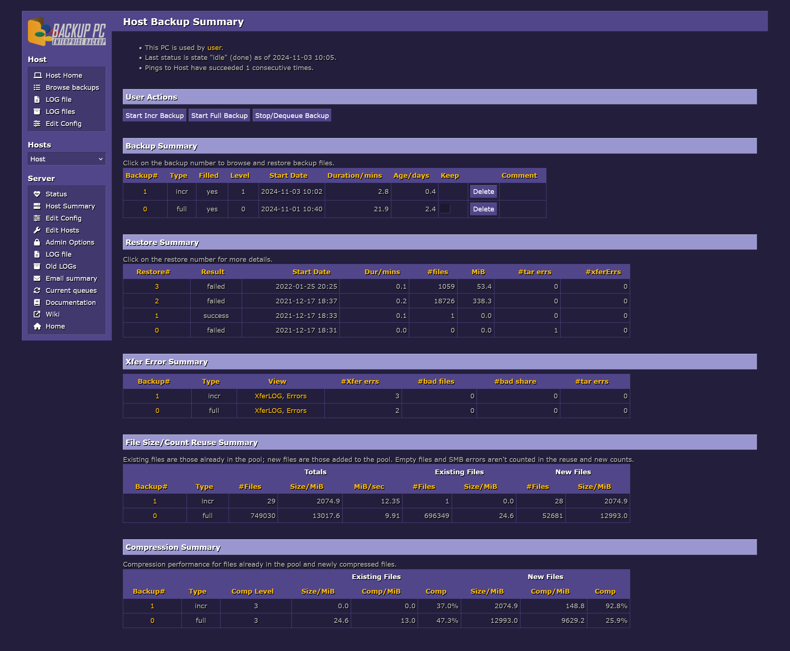

# How to use
1. Download CSS files to `/usr/share/backuppc/image/`
2. Update `$Conf{CgiCSSFile}` to the css file name
    * in the GUI go to **Edit Config** → **CGI** → **CgiCSSFile**
    * or edit `/etc/backuppc/config.pl` at `$Conf{CgiCSSFile}`

# General troubleshooting
## Menu icons not showing
There are 2 potential problems you may encounter:

1. Browsing the GUI with a different subfolder other than the default `/backuppc/`
    #### Fix
    In the CSS file replace all `/backuppc/index.cgi` with `/yoursubfolder/index.cgi` or just `/index.cgi` in case you use a top level domain.

2. Your webserver has a strict `Content-Security-Policy` header set.

    If this is the case you can see an error in your browser's dev tools console.
    #### Fix
    Ensure the `style-src` part of the header allows `use.fontawesome.com`

# Themes
|||
|---|---|
|<h2>90s</h2>
Retro theme with SNES/Famicom colors with [this list](https://www.raphnet.net/design/console_colors/index_en.php) as reference.

Added 2024-11-02, updated 2024-11-03
||
|<h2>Modern</h2>
Heavily inspired by INSPINIA Bootstrap Theme.
<h3>Troubleshooting</h3>
If the host menu is out of place, change the <tt>margin-top</tt> values in:
<pre>br + div[class="NavMenu"] {} div[class="NavMenu"] + div[class="NavMenu"] {}</pre>
Added 2017-09-04, updated 2023-04-14
||
|<h2>reset.css</h2>
Resets CSS and some BackupPC quirks to start building your own theme on.

Clear <tt>$Conf{CgiCSSFile}</tt> before you start and use a userstyle editor like Stylish.

Added 2024-11-02, updated 2024-11-03
||
